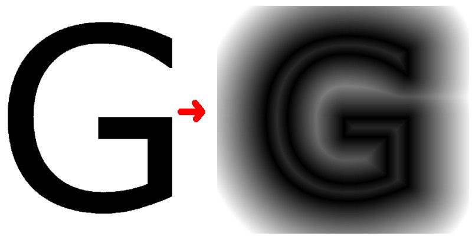

# sdf-generator
signed distance field generation of rasterized images with opengl



works in width * height * log(sdf_radius) time  

to build
```
mkdir build
cd build
cmake ..
make .
```
dependencies
<ul>
<li>glm</li>
<li>glfw</li>
<li>glew</li>
<li>opengl</li>
</ul>